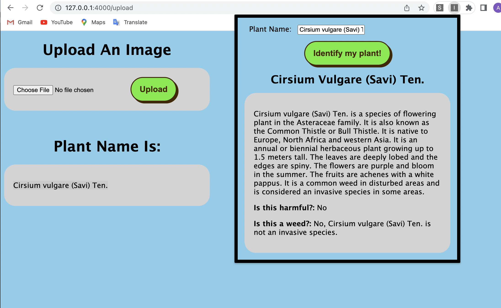

# Nature Namer

## Overview
Nature Namer is a Flask website that uses image recognition and a neural network to identify plant species.
A chrome extension was also created with OpenAI integration to give more information on the identified plant, including:
a brief description of the plant, if the plant is harmful, and if the plant is an invasive speces.

